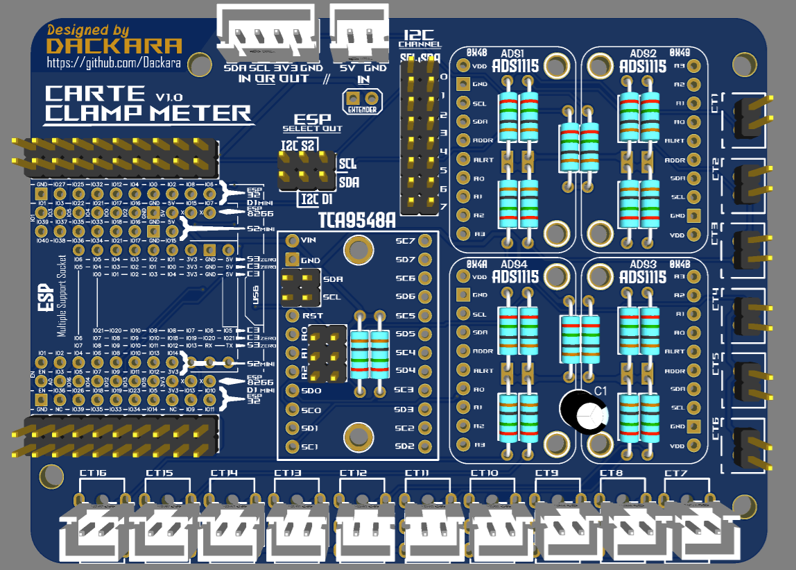
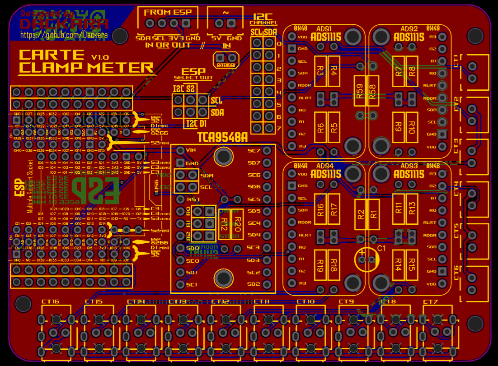

## [Clamp_Meter :](../main/hardware/addon_carte_clamp_meter)
Another option card created by  to monitor the passage of current through the clamps.
- 1 to 16 Clamp (2 mounting possible for each output : JST-XH for [2-strand clamp](https://s.click.aliexpress.com/e/_De0j7rx) or Jack for [SCT013](https://s.click.aliexpress.com/e/_DFRTWIN))
- 1 to 4 pre-addressed [ADS1115](https://s.click.aliexpress.com/e/_DF9geSz).
- 1 [TCA9548A](https://s.click.aliexpress.com/e/_DDACktb) (optional - bridging if not used) to multiplex the I2C (useful in the event of more than 4 ADS or I2C address conflict) with all its outputs remote for external use.
- 1 ESP possible at input for non-PVbrain users or other reasons... 6 assembly possible: (offset of all outputs and recovery of i2c via bridging).
  - [ESP8266 D1 Mini](https://s.click.aliexpress.com/e/_DmbvqH7)
  - [ESP32 D1 Mini](https://s.click.aliexpress.com/e/_DEU8tVB)
  - [ESP32 S2 Mini](https://s.click.aliexpress.com/e/_DdgwMVF)
  - [ESP32 C3](https://s.click.aliexpress.com/e/_DFystRx)
  - [ESP32 C3 Zero](https://s.click.aliexpress.com/e/_DeIlFtn)
  - [ESP32 S3 Zero](https://s.click.aliexpress.com/e/_DeIlFtn)
  
Link to the Github Page:  (Still in development)

| 3D View                   | Circuit                   |
| :-----------------------: | :-----------------------: |
| |  |
