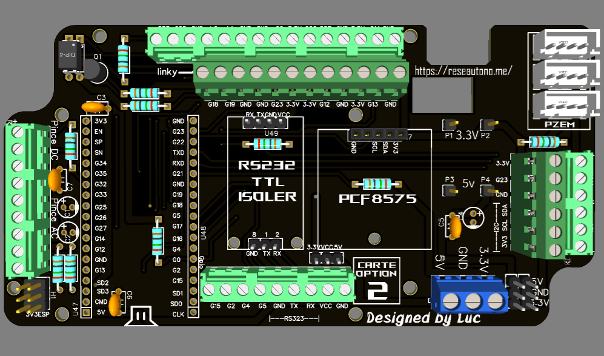

## ["Carte Option 2" :](../main/hardware/addon_carte_old_option2)
The old "Option 2" card made by  for the [PVbrain V1](https://github.com/Bandit-17/PVBRAIN) is also compatible with the __PVbrain V2__.
| 3D View                   |
| :-----------------------: |
| |

[French description here](../main/hardware/addon_carte_old_option2/Description_FR.md)
