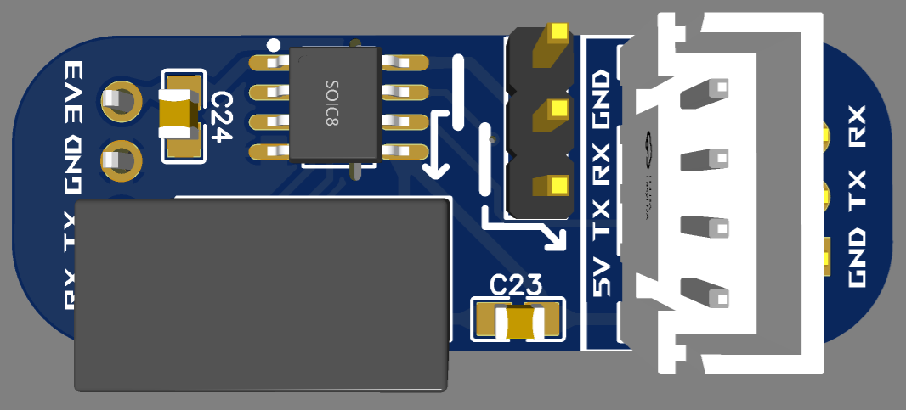
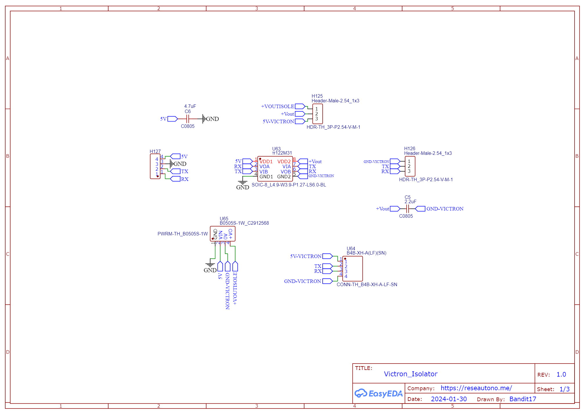
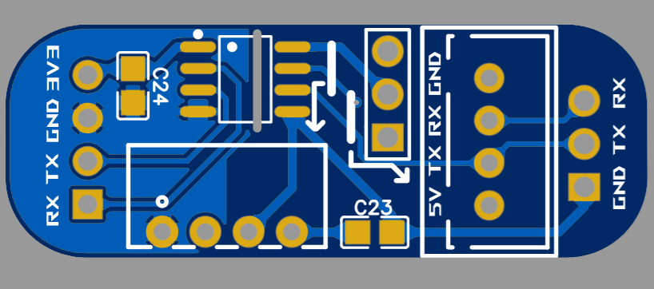
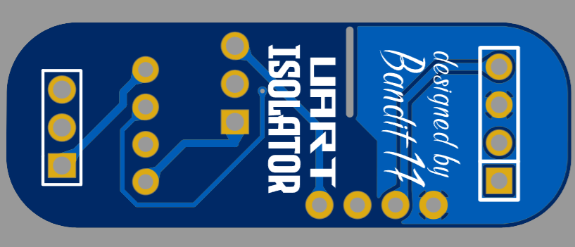
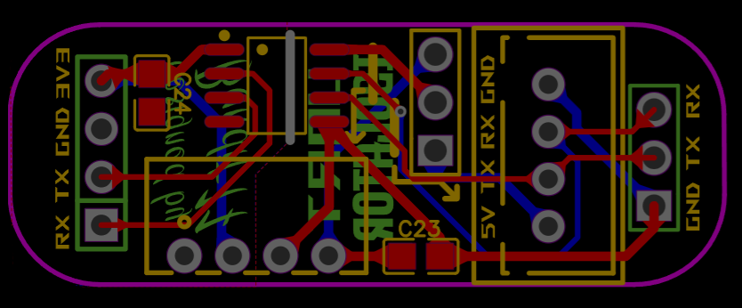

## [UART Isolator :](../main/hardware/module_uart_isolator)
TTL isolator, originally designed for Victron VEdirect.
- With the participation of ,  and  of the .

| 3D View                   | Schematic                 |
| :-----------------------: | :-----------------------: |
| |  |

| Front                     | Back                      | Circuit                   |
| :-----------------------: | :-----------------------: | :-----------------------: |
|  |  |  |
